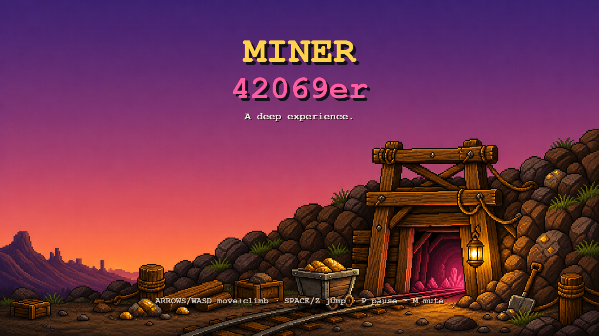
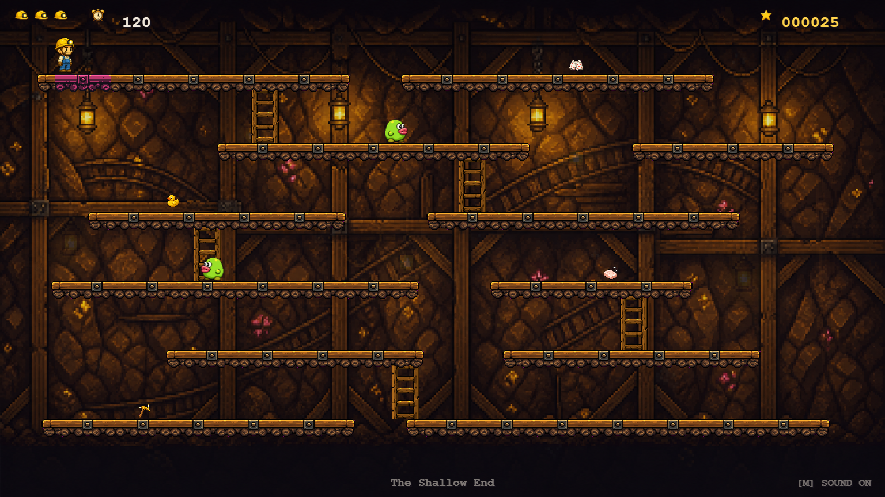
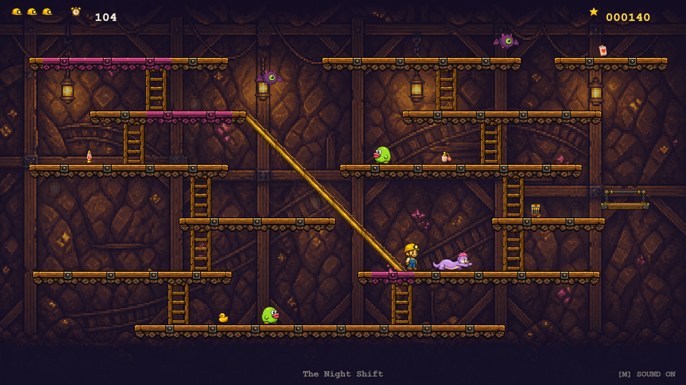
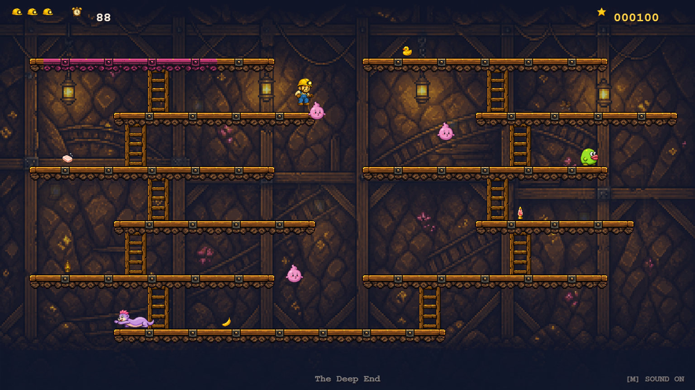
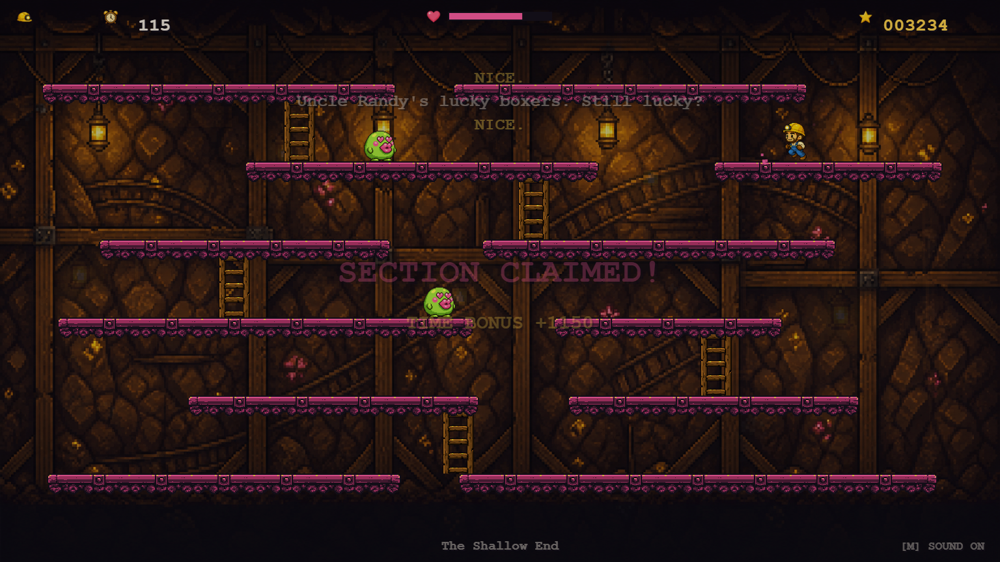

# Miner 42069er

Dusty Rodd just inherited his Uncle Randy's mine — but the deed only transfers once every
inch of the place has been walked, inspected, and stamped. Claim every platform section
before the shift timer runs out, pocket the previous crew's suspiciously personal lost
property, and mind the love-starved cave mutants: normally a single touch ends your shift,
but grab any pickup and they turn smitten for a few seconds — bop them mid-blush for a fat
bonus. Twenty levels down to the motherlode: dash-happy crabs, kissy gas-wisps,
a charm-immune mole from Human Resources, chain elevators, three-story slides,
conveyor belts, crumbling planks, stalagmite spikes, and power-ups from coffee
to a canary that stops the clock. An original arcade homage to the
claim-the-platform classics, with all humor strictly wink-and-nod.



## Play online

**▶ https://overplant-paving.github.io/miner-42069er/**

## Run locally

A static site — no build step, no dependencies. Serve the folder over HTTP
(ES modules won't load from a `file://` path):

```
python -m http.server 8341
```

Open http://localhost:8341/

## Controls

| Key | Action |
| --- | --- |
| ← → / A D | Run |
| ↑ ↓ / W S | Climb ladders |
| Space / Z | Jump |
| Enter | Start / restart |
| P | Pause |
| M | Mute (state shown bottom-right) |

Don't fall more than one platform row. Claims survive your deaths; the timer
doesn't. Chain claims within 2 seconds for streak bonuses; your best score is
remembered between sessions. Elevators are ridden by jumping aboard; slides are
one-way — step off the lip and enjoy the trip. Ladders stop at each landing:
release and press again to keep climbing past a floor. Cracked planks collapse after you
claim them, belts push you around, spikes are exactly as friendly as they look,
and the Prude cannot be charmed — route around him. Clearing a level restores a
life (up to 3).






## Credits

Art generated with agent-sprite-forge skills via OpenAI Codex; design & code by
Claude Fable 5 (Claude Code)
